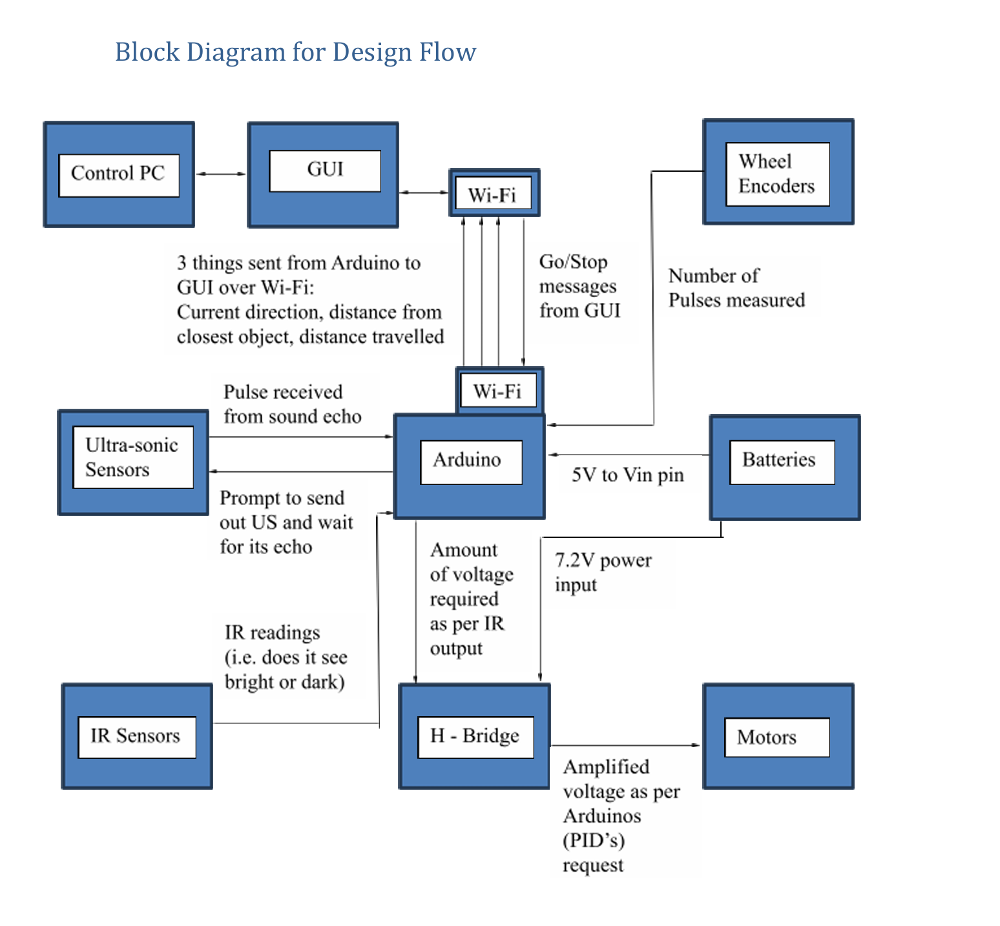
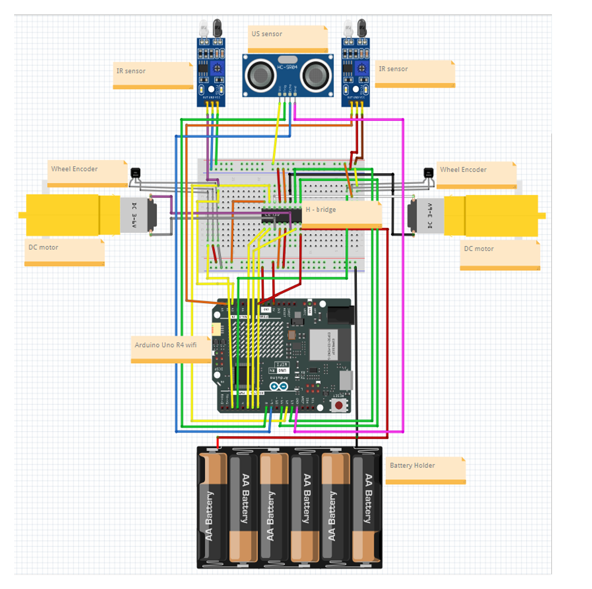

# Autonomous Line-Following Buggy

This was a team project completed as part of my Computer Engineering degree at Trinity College Dublin.

We built and programmed an Arduino-based buggy that could follow a line, detect objects in front of it and communicate with a PC through Wi-Fi.

## What the buggy does

- Follows a line using IR sensors
- Detects objects using an ultrasonic sensor
- Uses wheel encoders to measure speed and distance
- Uses PID control to maintain a target speed
- Communicates with a PC over Wi-Fi
- Can be controlled through a GUI
- Uses PWM to control the motors

## System Design

The diagram below shows how the PC, Arduino, sensors and motors were connected in the overall system.

## Hardware

The buggy used an Arduino Uno R4 WiFi, two DC motors, an H-bridge motor driver, IR sensors, an ultrasonic sensor and wheel encoders.

The IR sensors were used for line following, while the ultrasonic sensor measured the distance to objects in front of the buggy. The wheel encoders provided feedback for measuring speed and distance.

### Hardware Setup

## Software

The Arduino code handled the sensors, motors, line-following logic, PID speed control and communication with the PC.

We also developed a GUI in Processing which allowed the buggy to be started and stopped, change operating mode and set a reference speed. Information such as the buggy's speed and distance travelled could also be sent back to the PC.

## Challenges

A lot of the project involved testing and adjusting the buggy based on how it behaved on the track.

One of the main challenges was tuning the PID controller. We tested different values until the buggy could maintain its speed more consistently.

We also changed the steering method during development. Our original approach wasn't turning sharply enough, so we used pivot turns where one motor moved forward while the other reversed.

Another problem was that different battery voltages affected the motor speeds, which made testing less consistent.

## My Contribution

This was a team project. I mainly worked on:

- Parts of the Arduino code
- Wiring and sensor integration
- Testing and troubleshooting the buggy
- Adjusting sensors during testing
- Report writing and documentation
- Creating the final project demonstration video

## Project Files

- `arduino/` - Arduino code for the buggy
- `gui/` - Processing GUI
- `docs/` - Project reports and development log
- `images/` - Project diagrams

- `arduino/` - Arduino code for the buggy
- `gui/` - Processing GUI
- `docs/` - Project reports and development log
- `images/` - Project diagrams and images
